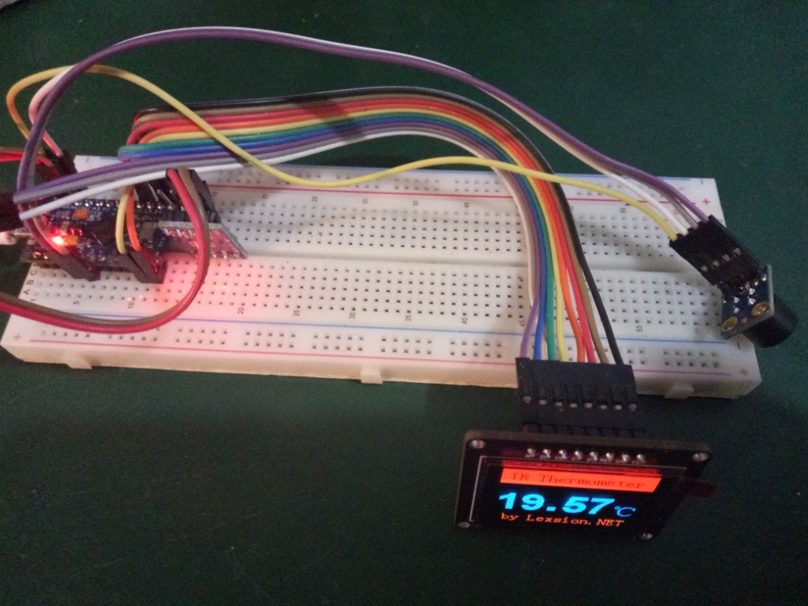
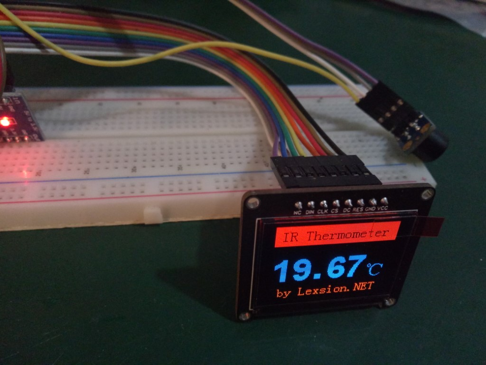

# Thermometer_MLX90614_SSD1351

## 简介：

本项目当前仅作测试学习，不是一个最终产品。基于Arduino平台，使用的开发板为Pro Micro（ATMEGA32U4）。通过I2C接口与MLX90614通信，通过硬件SPI驱动SSD1351 RGB OLED。有读写MLX90614的代码，但主函数仅实现隔三秒读取温度显示一次。欢迎各位为此项目添砖加瓦！

### 效果：

## 硬件：

MCU：ATMEGA32U4
Board：ProMicro （Arduino Leonardo）

OLED Driver　IC：SSD1351

OLED Power IC：ASM1117 3V3

温度传感器：MLX90614

### 引脚使用：

|   命名   | IO口 | 功能 |
| :------: | :--: | :--: |
| OLED_CLK | D15  | SCL  |
| OLED_DIN | D16  | SDIN |
| OLED_RES | D10  | RST  |
| OLED_DC  |  D9  | D/C  |
| OLED_CS  |  D8  | /CS  |

CS为 低电平有效   

| 功能             | IO口 |
| :--------------- | ---- |
| MLX90614_I2C_SDA | D2   |
| MLX90614_I2C_SCL | D3   |

## 代码实现简介：

I2C软件模拟部分，分别对通信协议中基础的片段进行了模拟，然后分层次拼接实现具体的读写功能。与某些I2C通信不同，这个SMBus协议中传输了一位PEC数据，用来校验传输的数据是否正确。我们读取时可以忽略，但是尝试写入时必然要发送PEC的。PEC的值是用本次读写操作中所有数据连在一起通过CRC-8校验得出的。比如写EEPROM时发送的PEC是由从机地址、欲写入的寄存器地址、数据低8位、数据高8位这些数据经过CRC-8校验得出。具体算法没弄懂，索性抄了网友的PEC生成函数，在PC上写了个临时程序验证OK，就这样用了。

手册（Datasheet）中给出的各种地址是需要拼上一个所谓的Opcode的，RAM部分的拼的是0，EEPROM拼的是001X XXXX。具体参考8.4.5. Commands。

EEPROM地址EMISS包含发射率参数(工厂默认1.0=0x FFFF)，这是个16位数值。计算公式为：Emissivity = dec2hex[ round( 65535 x ε) ]，其实就是65535乘以发射率（范围0.1~1.0），然后得出的结果转换为16进制值。修改EMISS需要先向该地址写0x0000，然后再将新的值写入。

实时的红外测温数据从TOBJ中读出，数据格式为4位16进制值，最高位为错误标记位。我使用的版本只有TOBJ1，所以我程序中读取的TOBJ1的数据。该数据乘以0.02得出的值即为当前红外传感器测得的绝对温度，即开氏温度。众所周知，此温度减去273.15即为摄氏温度。传感器量程能报告的最高温度为382.19℃（0x7FFF），如果报告数据最高位(MSB)为1（0x8XXX）则表示数据有错误，程序上需要做对应处理（目前程序中没有对此做处理）。另外我们可以从TA中读出传感器本身的当前温度数据（线性输出极限范围-38.2~+125℃），处理方式同上。

最后我们将得到的温度数据输出到屏幕上显示即可。

## TodoList:

1. 改为按键触发测量，添加灭屏休眠
2. 添加摄氏、华氏温度切换
3. 添加对于各种错误的处理
4. 添加通过按键修改发射率功能，用于不同测量场景
5. 设计一个用于体温测量的补偿算法

...欢迎补充